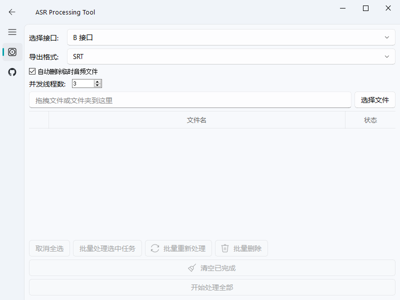

# ASRTools - 语音识别工具

基于原项目：https://github.com/WEIFENG2333/AsrTools 进行修改，使用更方便

## 📖 项目简介

ASRTools 是一款基于 PyQt5 开发的语音识别 GUI 工具，支持多种 ASR 引擎，提供便捷的音频文件转文字功能。界面简洁友好，支持批量处理、格式导出等功能。

## ✨ 主要优化点

1. **界面简化**：界面上仅保留 B 接口（BcutASR），操作更直观
2. **交互增强**：增加多种交互选项，提升用户体验
   - 支持批量音频文件处理
   - 支持多种导出格式（SRT、TXT、JSON 等）
   - 支持临时音频文件自动清理
   
3. **功能完善**：
   - 支持任务取消和强制终止
   - 支持中文路径兼容
   - 将ffmpeg打包进程序
   - 去掉任务弹出的终端窗口

## 📸 界面截图



## 🚀 使用方式

### 方式一：直接运行（推荐）

1. 从 [Release](https://github.com/Ryderey/AsrTools/releases) 页面下载最新版本
2. 确保 `ffmpeg.exe` 与可执行文件在同一目录
3. 双击运行即可

### 方式二：源码运行

#### 前置条件

- Python 3.8+
- `ffmpeg.exe`（需放在项目根目录或系统 PATH 中）

#### 安装步骤

```bash
# 1. 克隆项目到本地
git clone https://github.com/Ryderey/AsrTools
cd AsrTools

# 2. 创建虚拟环境（推荐使用 uv）
# 如果没有 uv，请先安装：https://github.com/astral-sh/uv
uv venv

# 3. 激活虚拟环境（Windows）
# 使用 uv 可直接运行，或手动激活：
# venv\Scripts\activate

# 4. 安装依赖
uv pip install -r requirements.txt

# 5. 运行程序
uv run python asr_gui.py
```

## 📦 打包说明

使用 `Nuitka` 将项目打包为独立的 `.exe` 文件。

### 前置准备

打包前请确保以下文件存在：

- `resources/app_icon.ico` - 应用图标
- `ffmpeg.exe` - 音频处理依赖（需放在项目根目录）

### 一键打包

项目提供了 `build.bat` 脚本，直接运行即可打包：

```bash
build.bat
```

打包完成后，可执行文件位于 `dist/asr_gui.exe`。

### 手动打包

如需自定义打包参数，可运行以下命令：

```bash
uv run python -m nuitka --standalone ^
    --onefile ^
    --windows-icon-from-ico=resources/app_icon.ico ^
    --windows-console-mode=disable ^
    --windows-product-name="ASRTools" ^
    --windows-file-description="ASR语音识别工具" ^
    --windows-company-name="ASRTools" ^
    --output-dir=dist ^
    --output-filename=ASR_GUI.exe ^
    --enable-plugin=pyqt5 ^
    --include-data-file=ffmpeg.exe=ffmpeg.exe ^
    --include-data-dir=bk_asr=bk_asr ^
    --include-data-dir=resources=resources ^
    --include-package=qfluentwidgets ^
    --include-package=bk_asr ^
    --remove-output ^
    --lto=yes ^
    asr_gui.py
```

### 打包参数说明

| 参数 | 说明 |
|------|------|
| `--standalone` | 独立模式，包含所有依赖 |
| `--onefile` | 打包为单个 exe 文件 |
| `--windows-icon-from-ico` | 指定应用图标 |
| `--windows-console-mode=disable` | 隐藏控制台窗口 |
| `--enable-plugin=pyqt5` | 启用 PyQt5 插件支持 |
| `--include-data-file` | 包含额外文件（如 ffmpeg.exe） |
| `--include-data-dir` | 包含整个目录 |
| `--include-package` | 显式包含特定包 |
| `--remove-output` | 打包完成后删除中间文件 |
| `--lto=yes` | 启用链接时优化，减小文件体积 |

## 📁 项目结构

```
AsrTools/
├── asr_gui.py           # 主程序入口
├── requirements.txt     # Python 依赖
├── build.bat           # 打包脚本
├── bk_asr/             # ASR 引擎实现
├── resources/          # 资源文件（图标等）
├── ffmpeg.exe          # 音频处理工具（需自行准备）
└── dist/               # 打包输出目录
```

## ⚙️ 依赖说明

### Python 依赖

```
requests
PyQt5
PyQt-Fluent-Widgets
```

### 外部依赖

- **ffmpeg**: 音频格式转换和处理的必备工具
  - 下载地址：https://ffmpeg.org/download.html
  - 放置位置：项目根目录或添加到系统 PATH

## 💡 使用提示

1. **支持的音频格式**：MP3、WAV、FLAC、M4A 等常见格式
2. **导出格式**：SRT（字幕文件）、TXT（纯文本）、JSON（结构化数据）
3. **批量处理**：可同时选择多个音频文件进行识别
4. **临时文件**：处理过程中会生成临时文件，可选择自动删除

## ⚠️ 注意事项

- 首次运行可能需要联网加载 ASR 服务
- 确保网络连接正常（BcutASR 需要访问 B 站接口）
- 大文件处理可能需要较长时间，请耐心等待
- 识别结果可能受音频质量和网络状况影响

## 📝 常见问题

### Q: 提示找不到 ffmpeg.exe？
A: 请将 `ffmpeg.exe` 放在项目根目录，或添加到系统环境变量 PATH 中。

### Q: 打包后运行闪退？
A: 请检查 `ffmpeg.exe` 和 `resources` 目录是否与打包后的 exe 在同一位置。

### Q: 识别失败怎么办？
A: 请检查网络连接，BcutASR 依赖 B 站的 ASR 服务。也可尝试其他 ASR 引擎。

## 📄 许可证

继承原项目的 LICENSE，详见 [LICENSE](LICENSE) 文件。

## 🙏 致谢

- 原项目：[WEIFENG2333/AsrTools](https://github.com/WEIFENG2333/AsrTools)
- ASR 引擎：Bilibili Cut（BcutASR）
- UI 框架：[PyQt-Fluent-Widgets](https://github.com/zhiyiYo/PyQt-Fluent-Widgets)
- 打包工具：[Nuitka](https://nuitka.net/)

---

如有问题或建议，欢迎提交 [Issue](https://github.com/Ryderey/AsrTools/issues)

