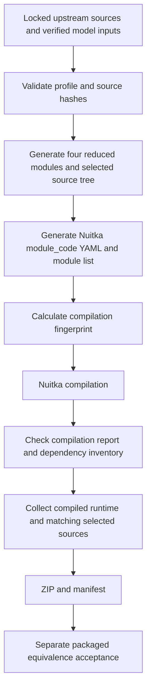

# FunASR inference pruning: technical design

Date: 2026-09-12. Status: **implemented and compiled**. The profile, generator and
build integration below exist as specified. G0 generation guards and the G1
original-vs-generated source equivalence comparison passed; the full candidate was
compiled and measured (606.01 MiB, `librosa`/`numba`/`llvmlite` absent from the
compilation report). Packaged-runtime acceptance (G3) remains user-owned and was
not run. See the implementation record in the
[package optimization plan](package-size-optimization-plan.md#8-implementation-record-and-measured-result).

This specifies stage B of the [package optimization plan](package-size-optimization-plan.md).
It refines the earlier import-transformation proposal into a guarded, generated
compilation view. No source transformation, compilation or inference has been
executed in this design round. Files described as new below are future implementation
work; only this document and its documentation link are written now.

## 1. Decision and compatibility boundary

Generate four reduced FunASR modules from the installed, pinned upstream source,
and supply those modules to Nuitka through its `anti-bloat.module_code` facility.
Retain the upstream numerical functions and checkpoint loader. Compile the
remaining required FunASR modules unchanged, using an explicit module list.

Use one authored profile, one small build helper and the existing release pipeline.
The output is a build artifact, not another installed ASR backend, a permanent
copy of FunASR in application source, or a manually edited virtual environment.

The supported product remains the existing CPU SenseVoice/Silero/fa-zh workflow.
`model_dir` continues to select the location of those verified assets. The trimmed
profile does not expose arbitrary upstream FunASR models, training, speaker
clustering, model downloading or model export. These are not current ASRTools
product features. No new customer-facing switch is introduced.

Keep Python 3.12.13, FunASR 1.2.6, Torch 2.6.0+cpu, torchaudio 2.6.0+cpu and Nuitka
4.1.3 fixed. Keep all nine model/config bytes, FFmpeg, GUI, online engine,
character alignment, native initialization order and batch lifecycle unchanged.

## 2. Evidence that determines the design

The current build explicitly includes all of FunASR. Its initializer recursively
imports submodules through `pkgutil.walk_packages`, while the application only
constructs the pinned aligner and calls its acoustic helpers.

| Evidence | Consequence |
|---|---|
| Installed FunASR has 370 Python files, including 78 package initializers | Package-wide inclusion is substantially broader than the selected model |
| Four proposed import replacements yield a static FunASR closure of 52 modules, including package initializers | A concrete starting list exists; it is not yet the validated frozen closure |
| SANM attention imports LoRA layers; subsampling/helpers reach SCAMA and Transformer code | Do not delete directories based on names such as `lora`, `scama` or `train_utils` |
| `CifPredictorV3` is defined in `models/bicif_paraformer/cif_predictor.py` | Keeping only `paraformer/cif_predictor.py` would lose the required predictor |
| `MonotonicAligner.__init__` creates SpecAugLFR and a loss object | Retain construction dependencies even in evaluation mode |
| `load_utils` imports librosa; `wav_frontend` imports an EEND feature module using librosa | Cut both entry edges, not just recursive registration |
| `AutoModel` imports speaker clustering and general download/export helpers | A selected registry alone does not remove those dependencies |
| Torch contains optional SciPy references in data decoding, testing and checkpoint-planning helpers | Prove exclusion against the whole application, not FunASR alone |
| Nuitka's literal replacement code uses `str.replace` and can make no change without failing | An unmatched replacement cannot serve as a reliable build guard |
| Nuitka 4.1.3 supports full `module_code` replacement and `--user-package-configuration-file` | Generate a complete reviewed module representation and verify its content |

Static closure analysis followed Python import statements, including imports inside
functions and their package ancestors, within FunASR. It substituted the four
proposed modules' dependency lists **in memory only**. It did not execute those
modules, resolve every dynamic import, or recursively analyze every external
package. Thus 52 is a candidate inventory, not a claim that the final EXE contains
only 52 Python modules or that all remaining imports are required at runtime.

## 3. Build and runtime flow



At runtime the interface stays:

```text
OfflineASR._load_alignment
  -> offline_alignment.load_aligner(model_dir, threads)
     -> reduced funasr initializer registers selected classes
     -> reduced AutoModel constructor
        -> original AutoModel.build_model
           -> original tokenizer, WavFrontend and MonotonicAligner
           -> original load_pretrained_model

offline_alignment.character_intervals
  -> original extract_fbank
  -> original WavFrontend / Kaldi fbank / LFR / CMVN
  -> original model.encode
  -> original calc_predictor_timestamp
  -> original ts_prediction_lfr6_standard
  -> existing ASRTools character validation and tail handling
```

Keep `load_aligner(...) -> (model, hashes, load_seconds)` and
`character_intervals(...) -> spans`. Keep the `.model` and `.kwargs` fields,
including `frontend` and `tokenizer`. The application continues calling
`model.model.eval()` and executing inference under `torch.inference_mode()`.

## 4. Four generated modules

### M1. `funasr/__init__.py`: deterministic registration

Retain the current `version.txt` read and `HYDRA_FULL_ERROR` setting. Import
`funasr.register` first, followed by these six defining modules using ordinary,
explicit import statements. Import reduced `AutoModel` after registration.
Remove recursive discovery and the unused `AutoFrontend` public import.

| Table | Required key | Defining module |
|---|---|---|
| `encoder_classes` | `SANMEncoder` | `funasr.models.sanm.encoder` |
| `predictor_classes` | `CifPredictorV3` | `funasr.models.bicif_paraformer.cif_predictor` |
| `frontend_classes` | `WavFrontend` | `funasr.frontends.wav_frontend` |
| `tokenizer_classes` | `CharTokenizer` | `funasr.tokenizer.char_tokenizer` |
| `specaug_classes` | `SpecAugLFR` | `funasr.models.specaug.specaug` |
| `model_classes` | `MonotonicAligner` | `funasr.models.monotonic_aligner.model` |

Assert each required registry value is the expected imported class. Do not assert
that the tables contain exactly six entries: retained source modules also register
sibling classes and aliases. Record those incidental entries and check their
origins against the accepted closure. Do not swallow registration exceptions.

The existing `register.py` inspect compatibility patch remains in force; it is
not reimplemented here. Test that module execution continues beyond decorators,
including the tokenizer's later `load_seg_dict` helper.

### M2. `funasr/auto/auto_model.py`: local model construction only

Generate a narrow `AutoModel` class with a small constructor and the original
`build_model` method copied with its `@staticmethod` decorator intact.
The method currently occupies lines 176–293, but extraction must use its AST
identity, not those line numbers.

Constructor responsibilities, in order:

1. Validate the selected profile before allocating models. Require the six selected
   configuration names, a mapping-valued `model_conf`, local initialization and
   tokenizer/frontend paths, CPU device, update checks disabled and remote code
   disabled. Accept actual model directory paths and the existing positive CPU
   thread setting; do not hard-code the developer's directories or a thread count.
2. Reject nonempty `vad_model`, `punc_model`, `spk_model`, remote checkpoint handles,
   or model-hub resolution requests. ASRTools owns its separate sherpa VAD already.
   Numeric model/frontend settings continue coming from the unchanged pinned
   configuration; profile validation must not rewrite them.
3. Preserve the original logging-level setup. Call the original `build_model`.
4. Populate `.model` and `.kwargs`, and preserve the disabled auxiliary model
   fields and their empty kwargs plus `.model_path` for a compatible local shape.

Retained imports are `logging`, `os`, `torch`, `ListConfig`, `deep_update`,
`tables`, `set_all_random_seed` and `load_pretrained_model`. `deep_update` keeps
its existing small module and OmegaConf dependency in the first version.

The original `build_model` contains a `download_model` reference when `model_conf`
is absent. Bind that name to an explicit unsupported-profile error; do not import
the download module. The constructor's validation makes this branch unreachable
for the supported product, and the explicit error protects direct misuse of the
static method. Do not substitute a fake download result.

Exclude `prepare_data_iterator`, general `generate`/inference/export methods and
their import dependencies from this reduced module. They are unused by
`offline_alignment.py`. Access to unsupported upstream APIs must fail explicitly,
not silently select a different behavior or auto-download a missing component.

Preserve `build_model` and `load_pretrained_model` arithmetic/behavior, including:

- RNG seeding, CPU selection and `torch.set_num_threads`;
- tokenizer creation, token ordering, vocabulary and frontend input dimensions;
- configuration merge order and `ignore_init_mismatch=False`;
- checkpoint wrapper handling, key-prefix mapping, CPU loading and evaluation
  mode applied by the application.

A new handwritten checkpoint loader, changed loading strictness, changed dtype,
or removal of constructor-created modules is outside this design.

### M3. `funasr/utils/load_utils.py`: retain `extract_fbank`

Generate the module from three import statements and the exact upstream
`extract_fbank` function:

```python
import torch
import numpy as np
from torch.nn.utils.rnn import pad_sequence
```

Retain all of that function's original branches, padding, shape/length handling
and output dtype conversions; the selected call is `extract_fbank([samples],
data_type="sound", frontend=...)`.

The unchanged MonotonicAligner module imports both `extract_fbank` and
`load_audio_text_image_video`. Provide the latter name as a function that always
raises an explicit unsupported-profile error. It must never be called by the
application's selected path; a call is an acceptance failure. This preserves
module import without compiling the general media loader. Do not pretend that
upstream MonotonicAligner.inference remains a supported application API.

Exclude librosa, kaldiio, general torchaudio media loading, pydub, model downloads
and `is_ffmpeg_installed()` import-time execution. The existing ASRTools FFmpeg
conversion still supplies the same PCM; no decoding capability is removed from
the product. Keeping the entire unused media loader with lazy imports would leave
its dependencies visible to compilation and would not enforce this boundary.

### M4. `funasr/frontends/wav_frontend.py`: selected frontend only

Retain the original imports needed by:

```text
load_cmvn
apply_cmvn
apply_lfr
WavFrontend, including both registration decorators and all five methods
```

Preserve `typing.Tuple`, NumPy, Torch/`nn`, torchaudio's Kaldi module,
`pad_sequence` and `tables`. Exclude `WavFrontendOnline`, `WavFrontendMel23` and
the EEND feature import used by the latter. Copy retained definitions verbatim,
including defaults, decorators and method bodies.

Do not change the current 16 kHz sample rate, 25/10 ms framing, Hamming window,
80-bin fbank, LFR 7/6, CMVN, sample scaling, short-input handling or dither.
`dither=1.0` is a current upstream default and must stay that way.

## 5. Source profile, generation and failure contract

Proposed authored input: `release-assets/funasr-inference-profile.json`.
It contains one schema/profile revision, exact runtime/compiler pins, hashes for
the four transformed files, named retained definitions, the required registry
mapping, the reviewed module closure, and dependencies proposed for exclusion.
Do not make this a general-purpose source rewriting framework.

Proposed helper: `scripts/prepare_funasr_profile.py`. It reads installed source
through filesystem paths/distribution metadata without importing the full FunASR
package. Its bounded workflow is:

1. Run after the existing environment/registry compatibility preparation.
2. Check versions and exact source hashes; parse the four source files with AST.
3. Require exactly one selected class/function at each expected scope.
4. Extract original source segments including decorators; combine them with the
   reviewed import lists and small constructor/error wrappers.
5. Parse the generated modules and compare ASTs of preserved functions/classes
   with upstream, excluding source locations only. Compile their syntax without
   executing imports or inference. Retain license headers and provenance.
6. Emit a selected `funasr/` source tree, the effective module list, a generation
   report, and YAML containing `anti-bloat.module_code` for exactly four modules.

Use Nuitka's supported full-module replacement rather than chains of unchecked
literal substitutions. Do not combine `module_code` and other source replacement
operations for the same module; its current implementation disallows that mix.
The generated YAML must be parsed and checked before Nuitka starts.

Observed source SHA-256 values for the current four inputs:

| Module | SHA-256 |
|---|---|
| `funasr` | `5100f1a66ff410f096ba0f42bc446f41a79c2de241c061aa4d00e8f3b427b97e` |
| `funasr.auto.auto_model` | `f04e9b984e0d12f109212e7a711e03eb276f20673e418165f88c9ac40417b520` |
| `funasr.utils.load_utils` | `73b55f1104ea5ee2304f0493a9b442a3b1ff90968183737b7cb24418cb673e23` |
| `funasr.frontends.wav_frontend` | `4771916cbbdc02ad095493ada7f2d9502a3f3c58befab0867d7e43769363d26f` |

These identify the locally inspected files, not independent verification of
upstream distribution authenticity. Re-check them against the approved locked
environment during implementation. Do not automatically accept new hashes.

| Failure | Required behavior |
|---|---|
| Version/hash mismatch or missing AST node | Stop before compilation, name the input and expected contract |
| Changed preserved numerical/checkpoint function | Reject generation |
| Missing/wrong registry class | Fail candidate startup/model preparation |
| Unsupported configuration or stub invocation | Explicit error; no fallback, download, fabricated result or partial success |
| Unexpected module in final inclusion closure | Fail the closure gate and inspect its importer before changing the list |
| Required inference path imports an excluded dependency | Restore dependency or redesign the boundary; never hide the import error |

## 6. Candidate closure and external dependency policy

The following is the **52-module static candidate**, including package ancestors.
Use it as a review input; do not silently regenerate an ever-growing allowlist
from each build and thereby accept newly introduced dependencies.

```text
funasr
funasr.auto
funasr.auto.auto_model
funasr.frontends
funasr.frontends.wav_frontend
funasr.models
funasr.models.bicif_paraformer
funasr.models.bicif_paraformer.cif_predictor
funasr.models.ctc
funasr.models.ctc.ctc
funasr.models.lora
funasr.models.lora.layers
funasr.models.monotonic_aligner
funasr.models.monotonic_aligner.model
funasr.models.paraformer
funasr.models.paraformer.cif_predictor
funasr.models.sanm
funasr.models.sanm.attention
funasr.models.sanm.encoder
funasr.models.scama
funasr.models.scama.utils
funasr.models.specaug
funasr.models.specaug.mask_along_axis
funasr.models.specaug.specaug
funasr.models.specaug.time_warp
funasr.models.transformer
funasr.models.transformer.attention
funasr.models.transformer.embedding
funasr.models.transformer.encoder
funasr.models.transformer.layer_norm
funasr.models.transformer.positionwise_feed_forward
funasr.models.transformer.utils
funasr.models.transformer.utils.add_sos_eos
funasr.models.transformer.utils.multi_layer_conv
funasr.models.transformer.utils.nets_utils
funasr.models.transformer.utils.repeat
funasr.models.transformer.utils.subsampling
funasr.register
funasr.tokenizer
funasr.tokenizer.abs_tokenizer
funasr.tokenizer.char_tokenizer
funasr.train_utils
funasr.train_utils.device_funcs
funasr.train_utils.load_pretrained_model
funasr.train_utils.set_all_random_seed
funasr.utils
funasr.utils.datadir_writer
funasr.utils.load_utils
funasr.utils.misc
funasr.utils.postprocess_utils
funasr.utils.timestamp_tools
funasr.utils.torch_function
```

External direct references in this modeled closure include Torch, torchaudio,
NumPy, OmegaConf, PyYAML and `torch_complex`. Keep them initially. A `warpctc_pytorch`
reference remains inside CTC's alternate `ctc_type="warpctc"` branch; the shipped
configuration selects `builtin`. Do not install another backend or delete CTC
merely because the static scanner sees that reference.

| Group | First implementation policy |
|---|---|
| Torch CPU and torchaudio/Kaldi | Preserve binaries and versions; preserve Torch internals such as `torch.fx` used by SANM imports |
| NumPy and its BLAS, OmegaConf, YAML, torch_complex | Keep; shrinking these is not required for the first profile |
| librosa, Numba, llvmlite | Primary exclusion candidates after M1–M4 disconnect their imports |
| sklearn, SciPy and SciPy BLAS | Conditional whole-application candidates; do not assume all consumers were in FunASR |
| jieba, model-hub/OSS/export/training helpers | Exclude only if the full application's report and supported paths no longer require them |
| requests, SSL/crypto, Qt, sherpa-onnx, ONNX Runtime, sentencepiece | Preserve application/native needs; disappearance from the FunASR closure is not proof of whole-product redundancy |

Torch still has conditional `scipy.io` imports in
`torch.utils.data.datapipes.utils.decoder`, SciPy optimizer imports in
`torch._functorch._activation_checkpointing.knapsack`, and SciPy/Numba references
in testing helpers. Use the compiler's importing-module evidence to determine
which are included. Apply targeted exclusion only where the branch is outside
supported inference. Never broadly exclude `torch.*` to force SciPy out.

## 7. Nuitka, fingerprint and packaging integration

### 7.1 Compilation

Replace `--include-package=funasr` with explicit inclusion of the accepted module
list and pass the generated YAML using `--user-package-configuration-file`.
Keep existing Qt, sherpa, sentencepiece and metadata settings. Apply dependency
`--nofollow-import-to` exclusions only after the relevant import gate passes.
An exclusion flag alone is not proof that eager imports or dynamic loads are safe.

Do not use broad `--include-package-data=funasr` as a source inclusion mechanism.
Collect `version.txt` and any actual retained data consumers explicitly. Current
external fa-zh inputs remain under `_runtime/models`, governed by their existing
checksums. Python source copies are a separate collection step.

The new Nuitka report must record the effective module set and importing reasons.
Verify that all selected modules are compiled/present in the intended form and
that no unexpected FunASR module is included. Do not infer absence from the final
filesystem alone: compiled modules reside inside the executable.

### 7.2 Fingerprint

Extend the existing fingerprint with content hashes for:

- the authored profile and generator source;
- generated YAML and the exact generated Python contents;
- the effective accepted module/exclusion lists and source guard inputs;
- the compiler/runtime versions already captured by the existing mechanism.

A generated YAML file lives under a timestamped build directory. Normalize its
argument path to a stable logical identity for fingerprinting, while including
its content hash. Otherwise equal profiles rebuild solely because paths differ,
or changed profiles reuse old binaries because only a fixed pathname was hashed.
Keep the real path in the command and manifest. Test both same-content/new-path
reuse and changed-content/same-path invalidation.

The first changed profile requires a full recompile; an old large `.dist` cannot
be repacked into evidence that compiled modules were removed.

### 7.3 Source collection and provenance

Replace the current recursive source-copy loop at `build_release.ps1:390` with
collection of the accepted FunASR modules and their package initializers. Copy
the **generated** contents for M1–M4 and unchanged originals for retained modules.
Do not copy the original recursively scanning initializer over the generated one.

Use a new portable staging tree, not mutation of the reused compiled `.dist`.
Detect and reject extra FunASR sources left over from a prior profile. Ensure the
packaged tree agrees with the compiled closure, rather than allowing uncompiled
source fallback to restore a removed module. Verify inspect/linecache behavior
against the generated sources and the existing registry compatibility fix.

Keep required `.dist-info`, `version.txt`, model licenses and original notices.
Preserve full upstream source availability and the profile/generator in the
corresponding-source delivery; source delivery is distinct from executable payload
pruning. Add profile ID/hash, source inputs, generated output hashes, inclusion
list and compilation fingerprint to build provenance. Record runtime checks as
not run until the separate acceptance is actually performed.

## 8. Tests and acceptance gates

### G0. Generation without running the application

Test source-hash rejection, exact node selection including decorators, generated
syntax, unchanged ASTs for retained definitions, deterministic output and
fingerprint behavior. A unit fixture should include a changed upstream definition
that must be rejected; do not test only a profile constant against itself.

### G1. Original versus generated source behavior

In future explicit validation, run two separate fresh processes: one with the
locked original installation, one with the generated selected package tree
shadowing the installed FunASR. Check the loaded package path and disallow fallback
to the original tree. Keep external dependencies at the same versions.

The candidate process records attempted imports as well as successful imports.
Review caught/rejected dependency imports; broad exception handling must not make
a failed optional import look like proof of successful trimming. Exercise all
six required registrations and validate their concrete classes.

Compare the unchanged nine model/config hashes, parameter key/shape sets and
loaded tensor contents; token IDs/strings; feature shapes/dtypes/lengths and values;
encoded tensors/lengths; alphas/peaks; and final character/display-index/timestamp
results. Compare checkpoints after loading, not only file hashes.

Preserve RNG behavior. Use identical CPU threads, fresh-process seed state and
input order. For numerical checkpoints with dither, snapshot/restore equivalent
RNG states on both sides in the validation harness. Also compare ordinary
fresh-process end-to-end results without harness reseeding between operations.
Never turn dither off to pass the comparison. Determine baseline repeatability
before any numeric tolerance, and require matching final text and exported timing
for the controlled corpus. A new unexplained discrepancy blocks the profile.

Run with result caching disabled and a separate empty cache directory; verify
cache-hit behavior afterward. Since dependency versions stay the same, old cache
hits can otherwise conceal a new inference failure. Keep production cache identity
only after equivalence is established; changing a revision is not a substitute
for resolving a semantic discrepancy.

### G2. Compilation and package inventory

Only after G0/G1 pass, perform the full candidate build and preserve its report.
Require selected FunASR module inclusion, reviewed importer evidence for any
remaining heavy dependency, absence of excluded DLL/PYD/data/source payloads,
all model checksums, correct metadata lookup and correct portable layout.
Check both compiled and filesystem inventories.

Measure compressed and uncompressed size per group, executable size, member count,
compilation duration and artifact hash. A reduced source-file count alone is not
a size acceptance result. The baseline four native groups contain **176.73 MiB
raw / 62.05 MiB compressed**; these are the measured opportunity pool, not
guaranteed removals. EXE savings remain unquantified until the rebuild.

### G3. Packaged capability and performance

Require existing offline/GUI/Bcut checks, the real video batch and injected-failure
sequence, silence/short/long audio, unknown-character behavior, Chinese paths,
cancel/retry/close behavior, online selection, media conversion and SRT/TXT/ASS.
Test fresh-process sentencepiece-before-Qt order and one persistent offline owner.

Run on the supported clean Windows target without Python/compiler/system FFmpeg.
Preserve no automatic model/network retrieval, launcher behavior and native DLL
resolution. Compare cold model load, steady transcription time and peak RAM
against baseline with repeated same-machine measurements. Repeatable regressions
beyond baseline noise block acceptance.

The one-click builder continues not to start the application. G1 and G3 are
separate runtime validation activities, user-owned under the existing release
contract. This documentation round performs none of them.

## 9. File responsibilities and rollout

| Proposed file/change | Responsibility |
|---|---|
| New `release-assets/funasr-inference-profile.json` | Fixed profile, source hashes, selected nodes/registrations, reviewed closure |
| New `scripts/prepare_funasr_profile.py` | Bounded generation, guards, selected sources, YAML and generation report |
| `scripts/build_release.ps1` | Preparation order, selected Nuitka arguments, new staging source collection, report gate |
| `scripts/release_payload.py` | Fingerprint inputs and stable generated-profile argument identity |
| New `tests/test_funasr_profile.py` | Generator rejection/preservation cases and source-profile equivalence harness |
| `tests/test_release_helpers.py` | Profile invalidation/reuse and retained source/package consistency |

Application-facing `bk_asr/offline_alignment.py` and `bk_asr/OfflineASR.py` should
need no algorithm/interface change. If implementation requires one, explain it as
a design change before combining it with this profile. Do not change requirements,
Torch/Qt versions, model precision or FFmpeg in the same candidate.

Roll out in two bounded candidate checkpoints:

1. Four source projections + static registration, with external libraries still
   available: prove constructor, registry and numerical equivalence.
2. Accepted external/module/data exclusions + complete rebuild: prove frozen
   behavior and measure actual savings.

Keep the baseline ZIP and each candidate in separate timestamped directories.
On any failure, retain the report and return to the last verified artifact;
revert generator/profile selection, source collection and fingerprint integration
together. Do not add a production fallback that silently loads the original large
package. A result above the proposed overall 650 MiB target is reported honestly;
capability and equivalence gates take priority over the number.
